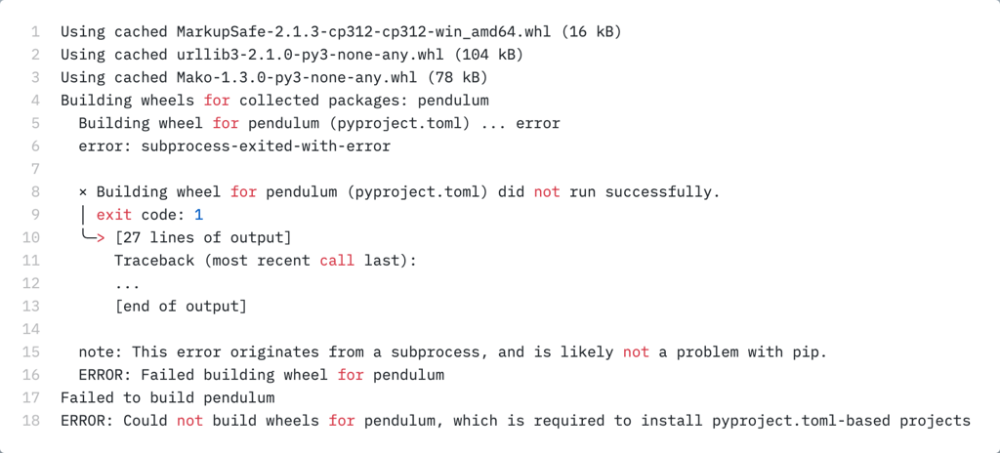

<style>
    h1 {
        font-family: Gill Sans;
        font-weight: 300;
    },
    body {
        font-family: IBM Plex Sans;
    }
</style>

---

# Front Matter: Survey

- Who uses Python regularly?
- How many people use Jupyter Notebook/Lab?
- How many people use Anaconda?
- What's your editor of choice?
- How many people know about `pip`?
- How many people create virtual environments for their Python projects?

---

# **Dependency Management with Python and Jupyter**
#### Managing Python Dependencies for Data Science Projects

Ian Lanham
@dataian@fosstodon.org
<!--- Not ready yet --->
<!--- Blog: [https://ianlanham.com](https://ianlanham.com) --->
GitHub: [https://github.com/ilanham](https://github.com/ilanham)
LinkedIn: [https://www.linkedin.com/in/ian-lanham/](https://www.linkedin.com/in/ian-lanham/)

---

# About Me

I've been a data professional for ~10 years, starting as a DBA on SQL Server and PostgreSQL. In 2023, I earned my Master's Degree in Data Analytics from UCF. It opened my eyes about how data science and its use can impact decision making across different business sectors.  

I got hooked on Python in 2017, and haven't stopped talking about it since.  

---

# What we're talking about

- As we use Python for more projects, you typically install more packages from PyPI:  
i.e. scikit-learn, pandas, or pytorch
- These packages (almost) always have dependencies to install:
  - dbt-core and flask require both `Jinja2` and `click` (at different versions)
- Currently dagster doesn't run on Python 3.12, but listed in requirements

---

**What does it look like?**
- Can be *hard* to document, they look a little different each time


---

# Another Example
- [Understanding Python Packages pip Dependency Resolver and Version Conflicts (with Solutions)](https://codingshower.com/pip-dependency-resolver-and-version-conflicts/) - codingshower.com
- The author shows the problem by installing two projects with a conflicting dependency from a `requirements.txt` file

---

##### How are module dependencies referenced in Python?

Since [PEP 621](https://peps.python.org/pep-0621/) they can appear in the `pyproject.tml` file inside the root of the modules' repo

```toml
# scikit-learn's pyproject.toml file
[build-system]
requires = [
    "setuptools",
...
    "numpy>=1.25",
    "scipy>=1.6.0",
]
```
- Prior to PEP 621, dependencies in `setup.py`

---

# Working around the Problem

- We run into this when trying to install dependencies a few ways:
  1. Install everything into the default Python environment ⚠️
  2. For notebooks: install Jupyter standalone and create a virtual environment for everything else
  3. Create a new virtual environment for _everything_ 😔
    - _I do this, it can get annoying_
    - Jupyter gets duplicated in each virtual environment

- To fight against this, we have tools

---

# `pip`
*The cause (and sometimes solution to) the problem*

- Installs packages to our Python environment
- Typical step 1 of 99.99% of Python tutorials: `pip install <something>`
- Installs packages from the Python Package Index ([PyPI](https://pypi.org))

---

# `venv` - 1
*Solution 1*

- Part of the Python standard library since 3.3, included after install from Python.org
- What is a virtual environment?
  - _"A folder structure that contains an isolated environment of Python and its dependencies"_
  - [YouTube - ArjanCodes - How to Create and Use Virtual Environments in Python With Poetry](https://youtu.be/0f3moPe_bhk?si=vQCP8VQrHx0rIR1d)
- Deeper dive: [Real Python - Python Virtual Environments: A Primer](https://realpython.com/python-virtual-environments-a-primer/)

---

# `venv` - 2

- **tl;dr**: for this topic, it isolates Python binaries & `pip` installs to a folder structure
- You can create a new venv and install different package versions from PyPI
  - `python3 -m venv my_new_environment`
- When activating a venv, the environment's Python binary is at the top of your environment path
- Think of it as the first (and maybe only) weapon you need to fight version incompatibility for proejcts

<!--- Demo here for `which python3` before/after venv activation --->

---

# virtualenv
*Solution 2*

- A project used prior to `venv`, starting with Python 2
- Much faster than `venv` when creating environments
- I can also specify a version of Python different than what I have installed:
  `virtualenv venv39 -p python3.9`

---

# Conda
*A solution for a different problem*

- Comes with [Anaconda](https://www.anaconda.com), a distribution of Python geared towards scientific computing, data science, and machine learning
  - Can install non-Python libraries (C, R, Rust, Julia, etc.)
  - `conda install rust --channel conda-forge`
- More of a replacement for `pip` and PyPI, they manage their own versions of populay PyPI packages and ensure compatibility
- Default install is > 4 GB 👀, over 250 packages included

---

# Managing Sanity in your Conda Install

- Creates a default virtual environment `base`, activates **_any_** time you open a terminal
  - To turn it off: `conda config --set auto__activate_base false`
  - _You should do this if you have a Python install with your OS or you installed Python yourself from [python.org](https://python.org)_
- You can create an environment from a .yml file similar to a requirements.txt file:
https://docs.conda.io/projects/conda/en/latest/user-guide/tasks/manage-environments.html
---

# Anaconda Navigator

- Like a GUI for exploring packages installed into a Python virtual environment
- Can also create new virtual environments from the GUI
- Helpful for those new to virtual environments
- VS Code Extension [Python Environment Manager](https://marketplace.visualstudio.com/items?itemName=donjayamanne.python-environment-manager) works similar to Anaconda Navigator

<!--- Demo of VS Code Extension --->

---

# Miniconda and Mamba

- Mini-conda: The `conda` program without 3-4 GB of extra binaries
- `mamba`: `conda` written in C++ 🏎️
- [conda-forge](https://conda-forge.org): A community-driven alternative to base `conda` and the Anaconda channel

---

# Why not just use Anaconda-based options?

- Anaconda came before `pip` had a lot of the features and libraries it does now
  - 1.0 release was in 2012, comparable latest Python release was 3.2
- `pip` has matured greatly since the release of `conda`
- If you develop Python libraries (not just data science/scientific computing), you may need to use a different package management workflow

---

# Where does Jupyter fit into this?
- It has a **LOT** of dependencies
- Two separate products:
  1. Jupyter Notebook (older style, most common)
  2. JupyterLab
- Depending on how you use Jupyter (native, webhosted, VS Code plugin), you can run into lots of problems managing conflicting dependencies in the same notebook
- Conda (and conda-forge) handle the version control for us

---

# Jupyter Cloud Offerings
- Anaconda.cloud
  - Looks like local Jupyter (with its plusses/minuses)
- Google Colab
  - Probably the easiest to get started with
  - Sign in with a GMail account
- AWS SageMaker Studio Lab
- Azure Machine Learning Workspace

<!--- Demo Google Colab --->

---

# AWS SageMaker

---

# More pip-based Tools
- Creator of `pipx` has a table with all of these projects and their strengths, weakenesses, and usecases
  - [The Big List of Python Packaging and Distribution Tools](https://chadsmith.dev/python-packaging/)

---

# pipenv

- pipenv = pip + virtualenv + pyenv
  - https://youtu.be/jVcN49sHbBQ?si=HDH11U2GLV-LSxwt

---

# pip-tools

- Can be installed by `pipx`
- Comes with `pip-compile`, input requirements by `requirements.in`
- `pip-compile` creates a full requirements.txt file from a rougher "requirements.in" file
- Source: https://youtu.be/G8PApVvdkjQ?si=s5bGzrcM8ymzZkFd

---

# pipx

- It focuses on modules that can be called from the command line
- A great alternative to creating a separate virtual environment for *just one tool*
- The tools installed with `pipx` are available gloablly

---

# poetry

- A dependency and environment manager
- Also a build system
  - https://youtu.be/jVcN49sHbBQ?si=HDH11U2GLV-LSxwt
- It can also help you publish to PyPI

---

# "But wait, there's more!"

- Hatch
- Rye
- pyenv
- PDM
<!--- Shows how many tools are out there to try and solve this problem --->

---

# Questions?


